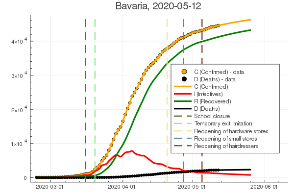

# Data Assimilation of the COVID-19 pandemic using an augmented SIR model

Periodical update of [assimilated
COVID-19-Data](https://www.zenodo.org/record/3738945) based on the
[Johns-Hopkins-University
database](https://github.com/CSSEGISandData/COVID-19.git) and data
from the [Robert-Koch
Institut](https://www.rki.de/DE/Content/InfAZ/N/Neuartiges_Coronavirus/Fallzahlen.html).
The source of the code used for the data assimilation, which may be used unlimitedly for non-commercial purposes, can be found [here](https://github.com/sesterhenn/Corona.jl).

## Contributors
* Jörn Sesterhenn (joern.sesterhenn@uni-bayreuth.de)
* Gabriele Camerlengo (gabriele.camerlengo@tu-berlin.de)

## Model
For the purpose of the data assimilation, the _Susceptible-Infectious-Recovered-Deceased_ ([SIRD](https://en.wikipedia.org/wiki/Compartmental_models_in_epidemiology#The_SIRD_model)) model is used.

## Legend
* Confirmed Cases and Deaths from the JHU or RKI. 
* Solid lines are assimilated results.  
* The growth rate  is given by , where .

## Results
An updated overview of the assimilation is shown in the following. The complete results can be visualized by clicking on _full report_. The numerical values are available in the [results](results) folder as CSV files. 

### Bavaria

[full report](reports/Germany-Bayern.md)

### New York

[full report](reports/US-New_York-New_York.md)

### Germany

[full report](reports/Germany.md)

### Italy

[full report](reports/Italy.md)

