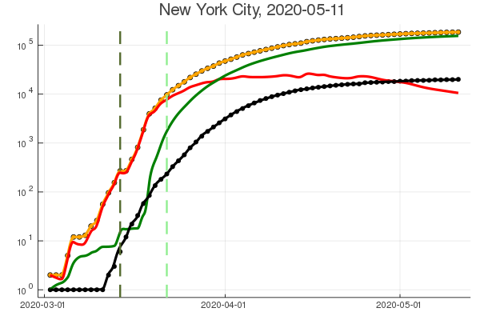
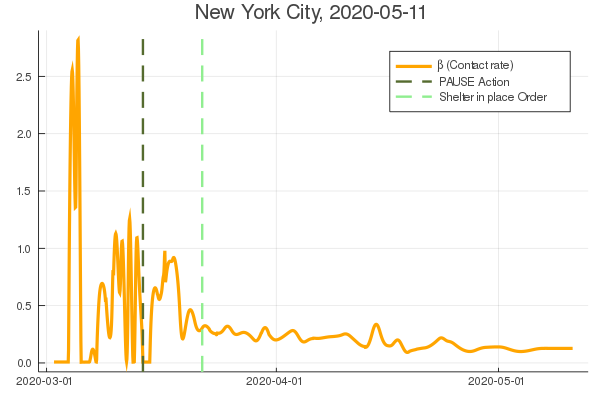
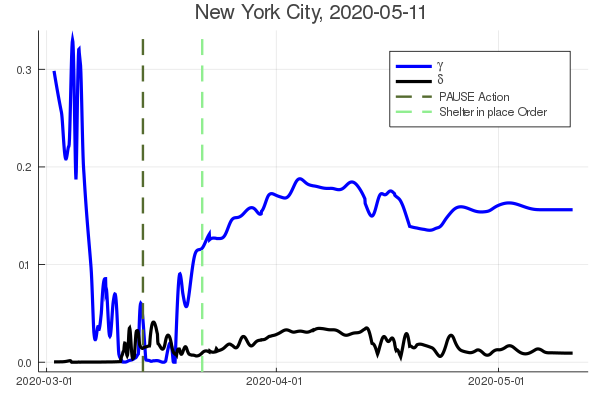
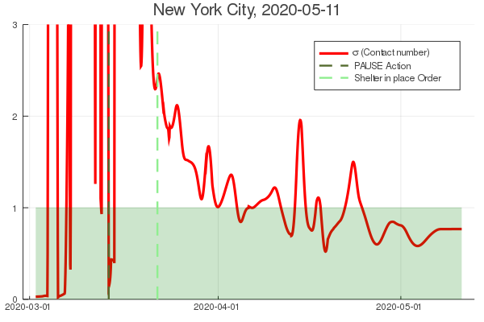

# Data Assimilation of the COVID-19 pandemia using an augmented SIR model

Periodical update of [assimilated
Corona-Data](https://www.zenodo.org/record/3738945) based on the
[Johns-Hopkins
database](https://github.com/CSSEGISandData/COVID-19.git) and data
from the [Robert-Koch
Institut](https://www.rki.de/DE/Content/InfAZ/N/Neuartiges_Coronavirus/Fallzahlen.html).
An updated overview of the assimilation is found on this page. The numerical
values, as well as the individual plots can be found in the
subfolders.

Maintained by Joern Sesterhenn and Gabriele Camerlengo.

## Legend
Confirmed Cases and Deaths from the JHU or RKI. Lines are assimilated results.  
The growth rate calculated from 

## New York

